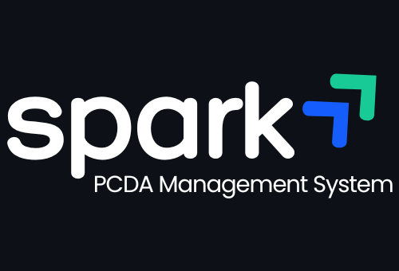
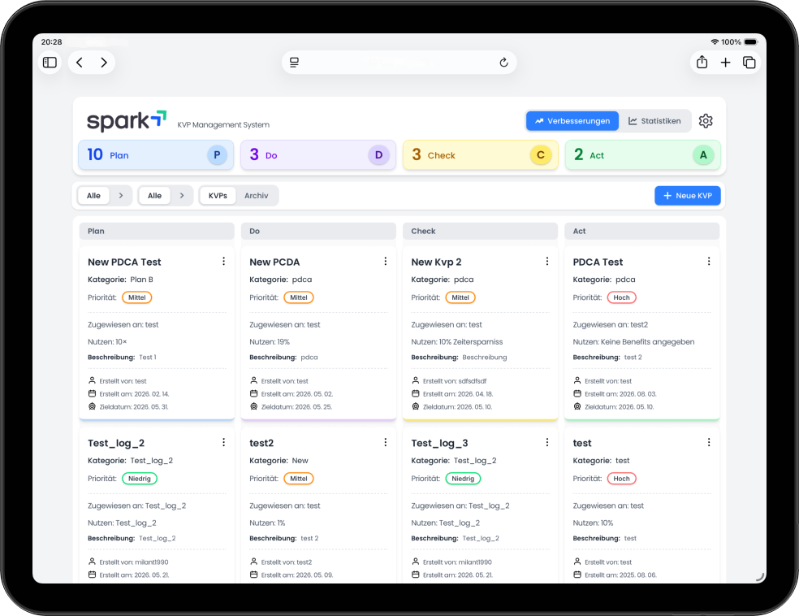
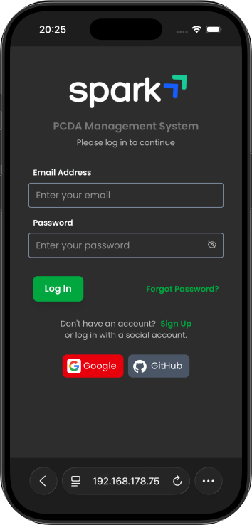

# The PCDA Management System

<p align="center">
  
</p>

<p align="center">
  <a href="https://pdcamanagement.netlify.app">
    
  </a>
  
  
  
  
  
  
  
</p>

<p align="center">
  A modern, browser-based <strong>PDCA cycle management application</strong> built with React + TypeScript + Vite.<br/>
  All data is stored locally via IndexedDB — <em>no server, no account, no data leaks.</em>
</p>

---

## 📸 Screenshots

<p align="center ">
  
  
  
</p>

---

## ✨ Features

| Feature                   | Description                                                      |
| ------------------------- | ---------------------------------------------------------------- |
| ✅ **PDCA Management**    | Create, edit, and delete PDCA cycles with full lifecycle support |
| 🔍 **Search & Filter**    | Quickly find items by keyword, status, or date                   |
| 📊 **Statistics**         | Visual overview of your PDCA activity and progress over time     |
| 📋 **Activity Log**       | Track every change with a detailed, timestamped audit trail      |
| 💾 **Offline-first**      | All data stored locally in IndexedDB — works without internet    |
| 📱 **Responsive Design**  | Fully functional on mobile and desktop                           |
| ⚡ **Fast & Lightweight** | Powered by Vite, zero backend overhead                           |
| 🌍 **Multilanguage**      | UI available in multiple languages, easily extensible            |
| 🎨 **Theme Support**      | Switch between Light and Dark mode with persistent preference    |
| 🔐 **Authentication**     | Sign in with Email, Google, GitHub, and more                     |
| 🧪 **Demo Mode**          | Try the app instantly — no registration required                 |

---

## 🛠️ Tech Stack

| Technology                                    | Version  | Purpose                  |
| --------------------------------------------- | -------- | ------------------------ |
| [React](https://react.dev/)                   | 19       | UI framework             |
| [TypeScript](https://www.typescriptlang.org/) | 5        | Type-safe JavaScript     |
| [Vite](https://vitejs.dev/)                   | 6        | Build tool & dev server  |
| [Tailwind CSS](https://tailwindcss.com/)      | 4        | Utility-first styling    |
| [Supabase](https://supabase.com/)             | latest   | Auth & backend services  |
| [Netlify](https://netlify.com/)               | latest   | Hosting & deployment     |
| IndexedDB                                     | (native) | Local persistent storage |

---

## 🚀 Getting Started

## 📁 Project Structure

```
kvp-management/
├── public/                   # Static assets (logo, favicon, etc.)
├── src/
│   ├── components/           # Reusable React components
│   │   └── items/            # PDCA item & activity log components
│   ├── storage/              # IndexedDB logic (kvpDatabase.ts)
│   ├── types/                # Shared TypeScript interfaces & types
│   ├── utils/                # Helper functions (e.g. formatDate)
│   └── main.tsx              # Application entry point
├── index.html
├── vite.config.ts
├── tailwind.config.ts
└── tsconfig.json
```

---

## 🔐 Authentication

The app supports multiple sign-in methods so users can get started quickly with their preferred account:

| Provider                | Type                                              |
| ----------------------- | ------------------------------------------------- |
| 📧 **Email & Password** | Classic credentials-based login                   |
| 🔵 **Google**           | OAuth 2.0 via Google account                      |
| 🐙 **GitHub**           | OAuth 2.0 via GitHub account                      |
| ➕ **More providers**   | Easily extensible with additional OAuth providers |

User sessions are managed securely and preferences (theme, language) are tied to the account.

---

## 🧪 Demo Mode

Not ready to create an account? No problem.

The app includes a **Demo Mode** that lets you explore all features instantly — no registration, no email, no commitment. Just click **"Try Demo"** on the login screen and you're in.

> ⚠️ Demo Mode is read-only. Some basic features are limited and not available for demo users. To keep your data, sign up and log in.

---

## 🌍 Multilanguage Support

The application supports multiple languages out of the box. The language can be switched directly from the UI, and the preference is saved locally.

**Currently supported languages:**

| Language   | Code |
| ---------- | ---- |
| 🇬🇧 English | `en` |
| 🇩🇪 German  | `de` |

---

## 🎨 Theme Support

The app comes with built-in **Light** and **Dark** mode support. The selected theme is persisted in the browser so your preference is remembered across sessions.

| Theme    | Preview                                             |
| -------- | --------------------------------------------------- |
| ☀️ Light | Clean, bright interface for daytime use             |
| 🌙 Dark  | Easy-on-the-eyes dark UI for low-light environments |

---

## 🌐 Deployment

The app is deployed and publicly accessible at:

**➡️ [https://pdcamanagement.netlify.app](https://pdcamanagement.netlify.app)**

---

## 📄 License

This project is licensed under the **MIT License** — see the [LICENSE](LICENSE) file for details.

MIT © [milty90](https://github.com/milty90)
